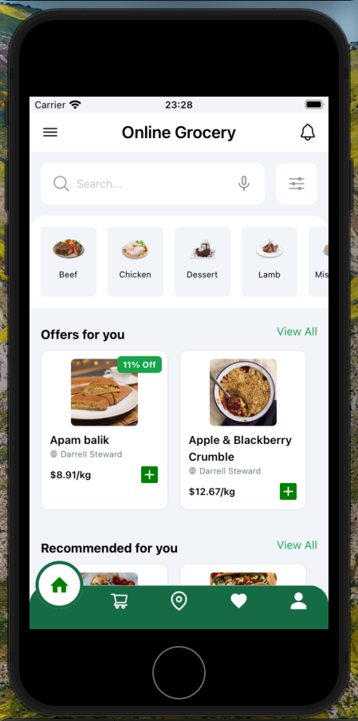
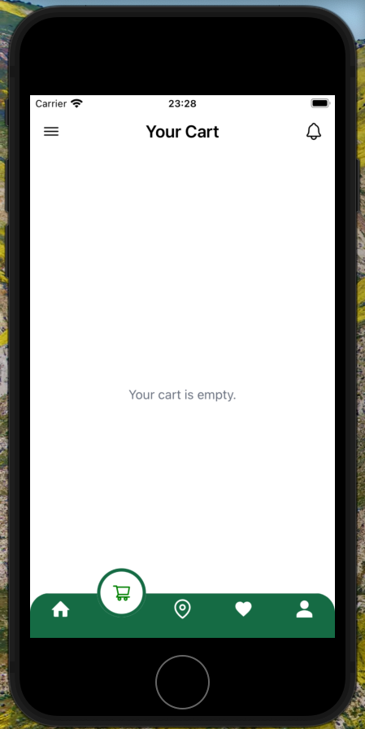
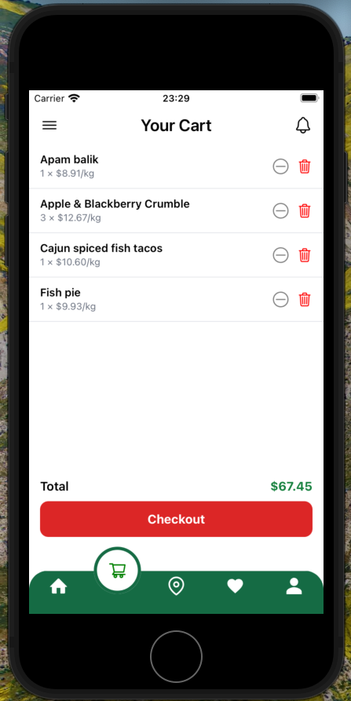

# 🛒 Online Grocery App (React Native + Expo + TypeScript)

Bu mobil uygulama, modern bir market alışveriş deneyimini kullanıcıya sunmak için Expo ve React Native kullanılarak geliştirildi. Projede TypeScript, Tailwind (NativeWind), React Navigation, Context API gibi güçlü teknolojiler tercih edilmiştir.

---

## 🚀 Özellikler

* ✅ **Modern UI**: Kullanıcı dostu arayüz (iOS tarzı görünüm)
* 🧭 **React Navigation**: Bottom Tab Bar ile kolay sayfa geçişi
* 🛒 **Sepet Yönetimi**: Ürünleri sepete ekle, azalt, sil
* 🧠 **Context API** ile global state yönetimi
* 🔍 **Arama**: Gerçek zamanlı ürün filtreleme
* 🍽️ **TheMealDB API** kullanımı
* 🧾 **Toplam Tutar Hesaplama** ve Checkout

---

## 📁 Proje Yapısı (Kısaltılmış)

```
my-expo-app/
├── components/
│   ├── Header.tsx
│   ├── SearchBar.tsx
│   ├── OfferCard.tsx
├── screens/
│   ├── HomeScreen.tsx
│   ├── CartScreen.tsx
│   ├── ProfileScreen.tsx
├── context/
│   └── CartContext.tsx
├── navigation/
│   └── TabNavigator.tsx
├── types/
│   └── OfferCardProps.ts
├── App.tsx
└── README.md
```

---

## 🧪 Kurulum & Çalıştırma

```bash
git clone https://github.com/Cavga1903/online-grocery-app.git
cd online-grocery-app
npm install
npx expo start
```

> **Not:** Eğer `react-native-reanimated` kullanıyorsanız en üste şunu eklemeyi unutmayın:

```ts
import 'react-native-reanimated';
```

---

## 📸 Ekran Görselleri






---

## 📦 Kullanılan Teknolojiler

* [Expo](https://expo.dev/)
* [React Native](https://reactnative.dev/)
* [TypeScript](https://www.typescriptlang.org/)
* [Tailwind (NativeWind)](https://www.nativewind.dev/)
* [React Navigation](https://reactnavigation.org/)
* \[Context API]
* \[Axios]
* [TheMealDB API](https://www.themealdb.com/api.php)

---

## 🧑‍💻 Geliştirici

* 👤 [Tolga Çavga](https://github.com/Cavga1903)

---

## 🤝 Katkıda Bulun

1. Fork yap 🔱
2. Yeni bir branch oluştur `git checkout -b feature/ekleme`
3. Commit yap `git commit -m '✨ Özellik eklendi'`
4. Pushla `git push origin feature/ekleme`
5. Pull Request gönder 🎉

---

## 📄 Lisans

MIT Lisansı

---

Hazırlayan: **Tolga'nın Gelişim Günlüğü** 🚀

---

## 🇩🇪 Deutsche Beschreibung

**Online Grocery App** ist eine moderne mobile Einkaufs-App, entwickelt mit Expo und React Native. Sie bietet eine benutzerfreundliche Oberfläche im iOS-Stil für das Einkaufen von Lebensmitteln.

### ✨ Funktionen

* ✅ **Modernes UI** — Benutzerfreundliche Oberfläche im iOS-Stil
* 🧭 **React Navigation** — Einfache Seitennavigation mit Bottom Tab Bar
* 🛒 **Warenkorb-Verwaltung** — Produkte hinzufügen, reduzieren, entfernen
* 🧠 **Context API** — Globale Zustandsverwaltung
* 🔍 **Suche** — Echtzeit-Produktfilterung
* 🍽️ **TheMealDB API** — Integration mit externer Speisen-API
* 🧾 **Gesamtbetrag-Berechnung** und Checkout

### 🧪 Installation & Start

```bash
git clone https://github.com/Cavga1903/online-grocery-app.git
cd online-grocery-app
npm install
npx expo start
```

### 📦 Verwendete Technologien

* [Expo](https://expo.dev/)
* [React Native](https://reactnative.dev/)
* [TypeScript](https://www.typescriptlang.org/)
* [Tailwind (NativeWind)](https://www.nativewind.dev/)
* [React Navigation](https://reactnavigation.org/)
* Context API
* Axios
